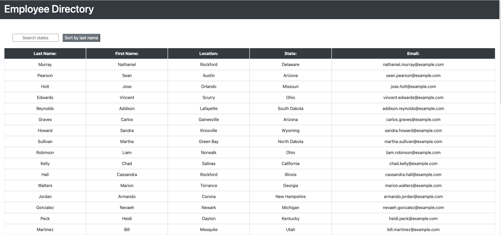

# EmployeeDirectory
#### A directory to allow managers access to all relevant information for their employees. Built with React.

### This project involves one page, along with two components to display the column titles, as well as dynamically updated columns of information. The employees are generated using a random users API, and the inforamtion that is returned is then organized. The user is able to sort the "employees" by last name, and to filter by which state they are from.

### Link to deployed application: [Employee Directory](https://protected-tor-04584.herokuapp.com/)
### 
